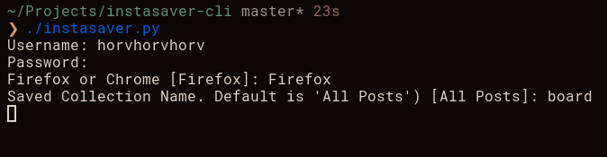

# InstaSaver-CLI

Python CLI to save an Instagram user's saved photos or specific saved collections to local device in full resolution, opposed to screenshots' loss in resolution.
 
Saves locally in project's directory: `./images/` 
 

